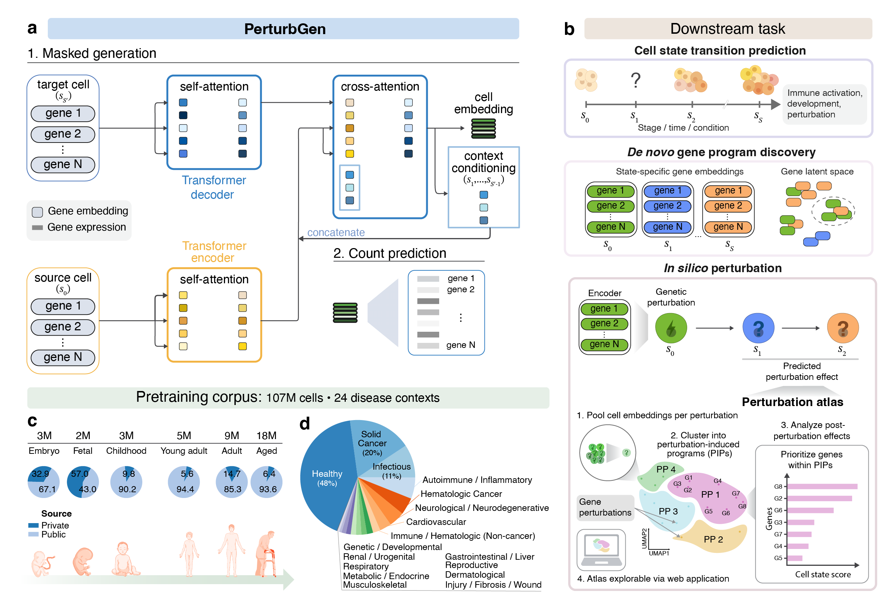

 [](https://opensource.org/licenses/MIT)
 

# PerturbGen foundation model for dynamic cellular states



A major challenge in biology is predicting how cells transition between states over time and how perturbations disrupt these transitions. Although recent approaches can predict single-cell perturbation responses in silico, they cannot predict responses across dynamic cell trajectories—for example, how early perturbations reconfigure later cell states. **PerturbGen** is a generative foundation model trained on over 100 million single-cell transcriptomes that predicts perturbation responses along cellular trajectories. It predicts how genetic perturbation at a source state shapes downstream states, alters gene programs, and modifies trajectories across time (e.g., in differentiation or disease progression).

**Applications:** This framework supports three downstream applications (Fig. 1b). First, PerturbGen predicts gene expression at specified target states, allowing inference of intermediate and future cell states. Second, learned gene embeddings can be aggregated across biological covariates, such as time, lineage, or developmental stage, to identify de novo, context-specific gene programs beyond predefined pathway annotations. Third, PerturbGen enables in silico perturbation analysis by simulating genetic interventions across cellular states. Scaling these simulations across genes yields perturbation atlases in which perturbations with similar transcriptional effects cluster together. We define these clusters as PIPs, which facilitate systematic identification of established regulators and discovery of previously unrecognized drivers of cell state transitions.

## 1. Usage

First, clone the repo and change to the project directory.

```shell
git clone https://github.com/Lotfollahi-lab/Perturbgen.git
```

Install Poetry (one-time):
(wanna know what is poetry? have a look at https://python-poetry.org)
```shell
curl -sSL https://install.python-poetry.org | python3 -
```
Optional: alternative way to install poetry using pipx (https://pipx.pypa.io/stable/installation/)
```shell
pip install poetry
```

Create/install the environment and dependencies:
```shell
cd Perturbgen
poetry env use python3.11
poetry install
```

Activate the enviroment
```shell
source "$(poetry env info -p)/bin/activate"
```

## Hardware requirements

Preprocessing, tokenization, and inference notebooks run on CPU (a machine with
≥32 GB RAM is recommended for the larger datasets).

**Training requires a CUDA GPU.** The training tutorials use `BATCH_SIZE = 64`,
which needs a high-memory GPU (**≥ 40 GB**, e.g. NVIDIA A100). On smaller GPUs this
value will cause out-of-memory (OOM) errors — for example, **24 GB cards
(e.g. RTX 3090/4090) cannot fit `BATCH_SIZE = 64`**.

If you hit an OOM error, lower the batch size via the `--batch_size` flag (or the
`BATCH_SIZE` variable in the training notebook). As a rough guide:

| GPU memory | Suggested `BATCH_SIZE` |
|------------|------------------------|
| ≥ 40 GB    | 64 (tutorial default)  |
| 24 GB      | 16                     |
| 16 GB      | 8                      |

Note that changing the batch size can affect training dynamics; to reproduce the
paper results exactly, use `BATCH_SIZE = 64` on a ≥ 40 GB GPU. The training code
automatically uses all visible GPUs (`devices=-1`); multi-GPU runs use
DDP by default and DeepSpeed (ZeRO stage 2) is available via
`--parallel_distribution deepspeed`, which also reduces per-GPU memory.

### Experiment logging (Weights & Biases)

Training/inference log to [Weights & Biases](https://wandb.ai). On machines
**without internet access** the default online mode can hang on wandb
authentication. To avoid this, run offline (or disable logging) via either:

```shell
export WANDB_MODE=offline        # affects all runs in the shell
# or pass the flag per run:
python -m perturbgen train-mask ... --wandb_mode offline
```

Use `--wandb_mode disabled` to turn logging off entirely. Set
`--wandb_entity <your-team>` (or `WANDB_ENTITY`) to log to your own wandb
account rather than the default.

The project contains some jupyter notebooks, which were converted to python files
due to better handling in the repository.
These files end with `_nb.py` and can be converted back to a `.ipynb` file with
`jupytext`:

```shell
jupytext --to ipynb --execute <your_file>_nb.py
```
## Examples

For usage, see the [documentation](https://perturbgen.cog.sanger.ac.uk/docs/examples/01_preprocessing_curation.html) or the local notebooks:
- [Preprocessing and data curation](docs/examples/01_preprocessing_curation.ipynb)
- [Tokenization and pairing](docs/examples/02_tokenization_pairing.ipynb)
- [Train PerturbGen](docs/examples/03_train_perturbgen.ipynb)
- [Gene Embedding Extraction](docs/examples/04_GeneEmbedding_Extraction.ipynb)
- [Gene Program Discovery](docs/examples/05_GeneProgram_Discovery.ipynb)
- [Perturbation](docs/examples/06_perturbation.ipynb)
- [Post Perturbation Analyses](docs/examples/07_PostPerturbation_Analyses.ipynb)

See Perturbation notebook for more explaination about how to perturb a gene or list of genes

## Documentation

Full documentation and tutorials are available at: [perturbgen.cog.sanger.ac.uk](https://perturbgen.cog.sanger.ac.uk/docs/examples/01_preprocessing_curation.html)

## Pretrained Checkpoints

The pretrained model checkpoint is available via Hugging Face:

👉 https://huggingface.co/lotfollahi-lab/PerturbGen/tree/main

⚠️ Note: The checkpoint in `pretraining_cohort/` is stored using Git LFS, and due to bandwidth limits, `git lfs pull` may fail with a 403 error.  
Please use the Hugging Face link above instead.

## Citation

If you use our repository or code in your research, please cite our paper:

```
@article{chi2026predicting,
  title={Predicting how perturbations reshape cellular trajectories with PerturbGen},
  author={Chi Hao Ly, Kevin and Miraki Feriz, Adib and Isobe, Tomoya and Vahidi, Amirhossein and Vaghari, Delshad and Rostron, Anthony and Quiroga Londono, Mariana and Mende, Nicole and Vijayabaskar, MS and Moullet, Marie and others},
  journal={bioRxiv},
  pages={2026--03},
  year={2026},
  publisher={Cold Spring Harbor Laboratory}
}
```

**Paper:** [Predicting how perturbations reshape cellular trajectories with PerturbGen (bioRxiv 2026)](https://www.biorxiv.org/content/10.64898/2026.03.04.709254v1)
