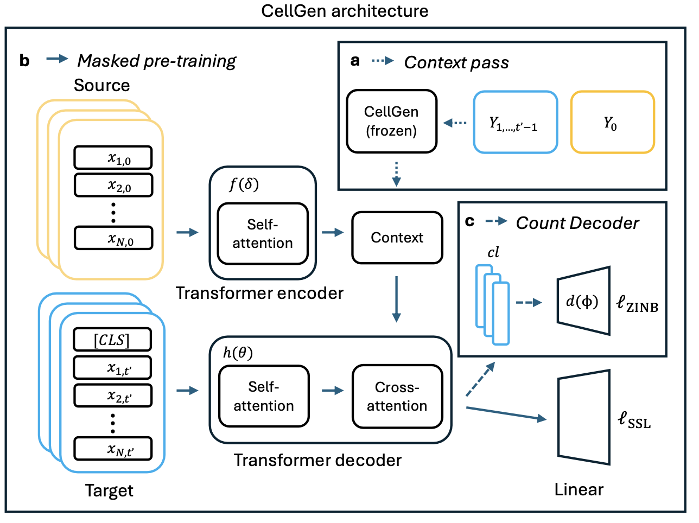

# CellGen: Single-Cell Gene Expression Generation

## Overview

**CellGen** is a generative sequence-to-sequence transformer model designed for simulating single-cell gene expression profiles to perturbations and predicting gene expression profiles at unseen time points. The repo contains the necessary scripts, configurations, and models to train and evaluate the CellGen model on single-cell datasets.



## Installation

1. Clone the repository:
    ```bash
    git clone https://github.com/Lotfollahi-lab/T_perturb.git
    cd T_perturb-main
    ```

2. Install the required dependencies:
    ```bash
    pip install -r requirements.txt
    ```

3. Install the package:
    ```bash
    python setup.py install
    ```

## Usage

### Run Tokenisation

To tokenize the data using Geneformer, run:
```bash
python T_perturb/T_perturb/pp/GF_tokenisation.py
```

or run the provided bash script:
```bash
bash T_perturb/T_perturb/batch_job_script/eb/run_GF_tokenisation.sh
```
This should result in a HuggingFace .dataset file.


### Training

Training of the **CellGen** model involves several key steps:

1. **Masked Language Model (MLM) Training**:
    ```
    bash T_perturb/T_perturb/batch_job_script/eb/run_train_masking.sh
    ```
    This will output a checkpoint for the masking step.

2. **Count Decoder Training**:
   Load the MLM checkpoint generated in the previous step and train the count decoder.
    ```
    bash T_perturb/T_perturb/batch_job_script/eb/run_train_count.sh
    ```
    This will output a checkpoint for the count decoder.

3. **Generate Function**:
   Use the generate function to create anndata by loading the checkpoints from both the masking and count decoder steps.
    ```
    bash T_perturb/T_perturb/batch_job_script/cytoimmgen/run_val_return_embed.sh
    ```

4. **Checkpoint and Anndata Comparison**:
   Use the generated anndata and the checkpoints to compare results if any changes are made during model updates or adjustments.

The training checkpoints will be saved automatically in `T_perturb/T_perturb/Model/checkpoints`.

To train on your own data, modify the directory in `train.py` and prepare your `.h5ad` data files.

### Validation

Scripts for model validation are available in the batch_job_script directory. For example:
```bash
bash T_perturb/T_perturb/batch_job_script/eb/run_val_generate.sh
```

### Testing
To run tests:

```bash
bash run_test.sh
```

## Contributing

New ideas and improvements are always welcome. Feel free to open an issue or contribute
over a pull request.
Our repository has a few automatic checks in place that ensure a compliance with PEP8 and static
typing.
It is recommended to use `pre-commit` as a utility to adhere to the GitHub actions hooks
beforehand.
First, install the package over pip and then set a hook:
```shell
pip install pre-commit
pre-commit install
```

To ensure code serialization and keeping the memory profile low, `.ipynb` are blacklisted
in this repository.
A notebook can be saved to the repo by converting it to a serializable format via
`jupytext`, preferably `py:percent`:

```shell
jupytext --to py:percent <notebook-to-convert>.ipynb
```

The result is a python file, which can be committed and later on be converted back to `.ipynb`.
A notebook-python file from jupytext shall carry the suffix `_nb.py`.

### Discussion Board

This repository is accompanied by a discussion board intended for active communication with and among the community.
Please feel free to ask your questions there, share valuable insights and give us feedback on our material.


## License
This project is licensed under the MIT License - see the LICENSE file for details.

## Acknowledgements
TBD
